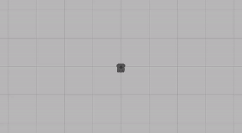
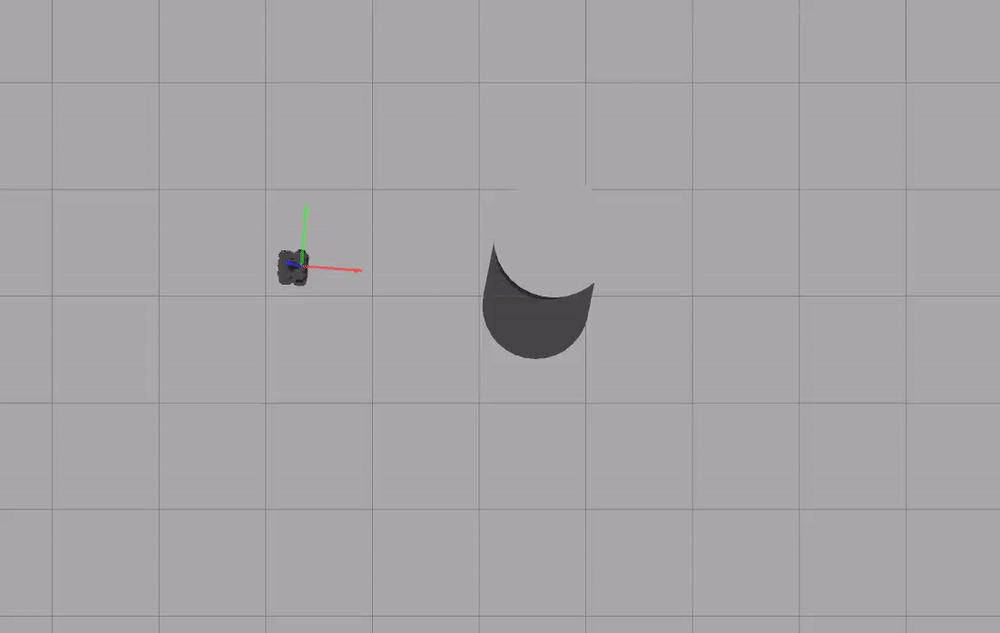
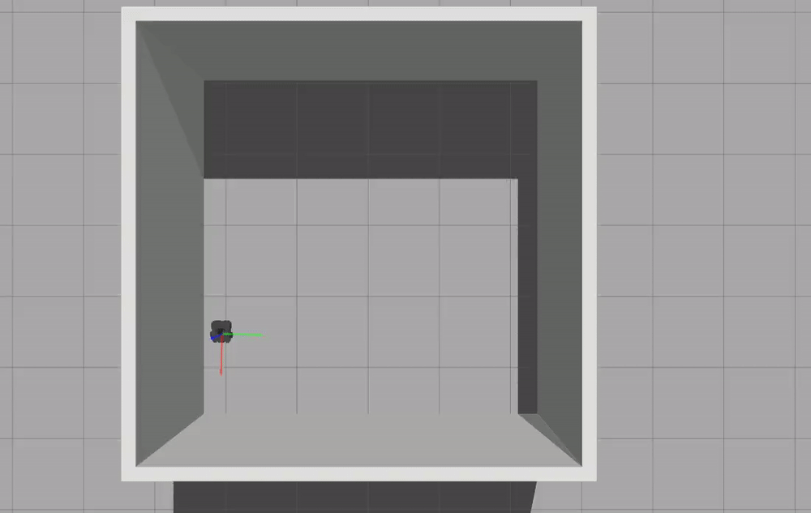

# warmup_project

## **Behaviors**
## Drive in Square:
### Description: 
This behavior causes the robot, upon initialization, to drive in a quare. I turned the robot after a certain number of seconds had elapsed and then drove in a straight line until I turned again. This is in a while loop that continues until shutdown.
### Code explanation: 
I created a class, DriveInSquare, with two functions; init(), and run(). In my init() function I initialize a rospy node: drive_in_square, a publisher: twist_pub, and a Twist variable: twist, composed of angular and linear velocities. The angular velocity is initialized at 0 and the linear velocity has an inital x value or 0.2. In my run() function I start a while loop that drives the robot in a straight line for 5s at 0.2 linear.x speed, then rotates the robot by setting angular.z velocity to 1 for 1.6 seconds and then sets angluar.z velocity back to zero. Then when the loop runs again, the robot moves in its new direction for 5s and drives in a square after every 4 iterations of the loop.
### Gif: 

## Person Follower:
### Description: 
For this problem I made a robot that searched for an object and moved close to it. I divided up my situation into 3 cases: The robot sensor read infinity, the robot detected an object but was too far away, and the robot was at the target distance from an object. I then, respectively, either spun the robot until an object was sensed, moved towards the object, or stopped the robot.
### Code explanation: 
My code is based off the stop at wall file from class. I subscribe to /scan and publish to /cmd_vel in my init function. In my process scan function I check the sensor of the robot and implement the above functionality by altering the angular and linear velocities. Specifically, if the robot senses nothing, I set angular velocity to .3 to turn it until it finds an object. If it finds an object but is too far away, I set angular velocity to 0 so it doesn't spin anymore and set linear velocity to .1. If the robot is the target distance from the object I set both velocities to 0. In my main function I just keep rospy spinning.
### Gif: 

## Drive in Square:
### Description: 
This program has a robot search for a wall and then once it finds one, continuously follows the wall. I pull data from multiple points on the robots sensor to detect how close it was to any walls and corners and keep it a consistent distance from them on all sides. I use the front sensor to detect any upcoming corners and I use a sensor on the front right of the robot to detect how far the robot is from the adjacent wall (because my robot moves counter-clockwise).
### Code explanation: 
This program is also based off of stop at wall, so most of the initialization is the same. My process scan function is composed of 5 main conditionals, which check which state the robot is in and makes decisions based off of this sensor information.
* I first check if the robot is right against a wall, in which case I back up by setting linear velocity to -0.3
* If that case is not triggered I check if the front sensor is within .7 of the wall or if the side sensor is within the set buffer distance from the wall. If either of these are true, I turn the robot away from the wall slightly by setting angular velocity to .3 and linear velocity to .1.
* If neither of these are true, I check if the front sensor is within the set distance *(1)* from the wall. If it is I start turning a lot by setting angular velocity to .8 and linear velcoity to .3.
* If the front sensor is greater than *1* away from any wall, I have two cases:
    * If the robot has turned too far away from the wall I turn slightly back towards it by setting angular velocity to -.1 and linear velocity to .1
    * If not, I drive straight by setting angular velocity to 0 and linear velocity to .2
### Gif: 

## **Challenges:**

## **Future Work:**

## **Takeaways:**

